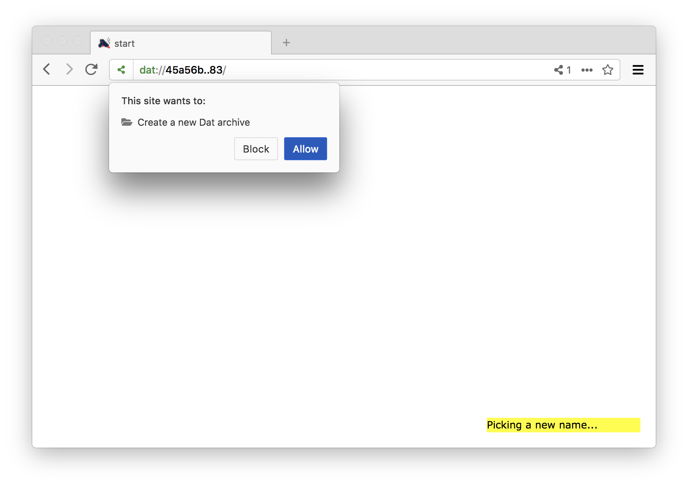
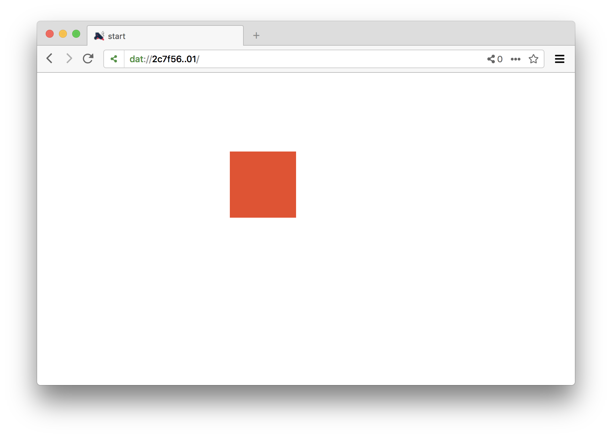
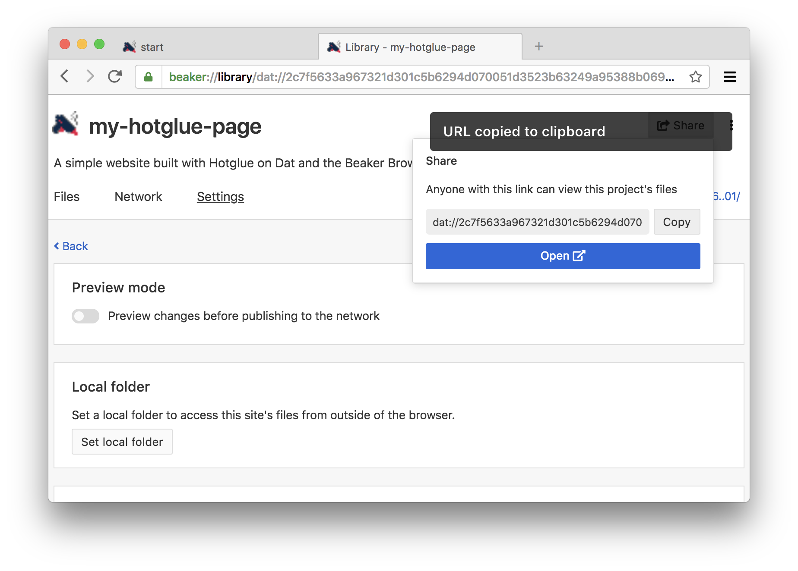
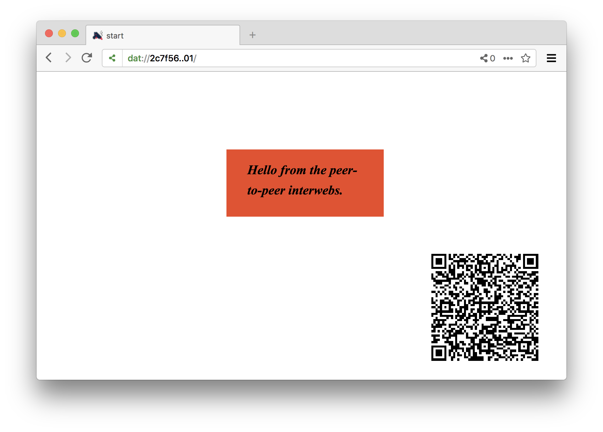

# Hotglue on Dat & Beaker

This is an experimental version of the [Hotglue](http://hotglue.me/) site-building software, made to work on top of the [Dat protocol](https://www.datprotocol.com/) and the [Beaker Browser](https://beakerbrowser.com/), by [@mrgohai](https://twitter.com/mrgohai).

## How to get started

* Install the [latest version of the Beaker browser](https://beakerbrowser.com/install/) on your system. I tested this with version 0.8.8.

* Launch the Beaker Browser

* Navigate to [https://hotglue-dat.sukzessiv.net/](https://hotglue-dat.sukzessiv.net/). This will redirect you to a site on the Dat protocol.

  If this fails to work for some reason, you should also be able to download the latest version of this software directly from GitHub using [this link](https://github.com/gohai/hotglue/archive/dat.zip), although the installation steps will differ a bit from how they are described in this document.

* Click the link to "fork this archive" in the bottom right corner. This will create an editable copy of the Hotglue sofware on your machine.

Give your site a more (or less) descriptive name like so.

And give the script permission to create a new archive on your behalf.

After this is done, the browser will redirect you to your page you just created. You will see the Dat URL in the address bar changed from what it was before to something unique to your fork.

Hotglue will ask you if you for your name - this is to tag edits for the revision browser. This is not necessary though, and you can also press "Cancel" if you rather not. (In any case, the information is only stored locally in your archive, which is only accessible to people who you give its Dat URL.)

Let's start working on the site itself!

We're starting with an relaxing empty page... clicking the background brings up the "New Object" menu of Hotglue. Here we can e.g. create new text objects, or upload different images and media files.

Let's create a text object for now. It is the first icon (all UI elements have descriptive tooltips when you hover over them with your mouse).

The monochrome square. This is how everything starts in Hotglue. Yours might have a different color, since this gets chosen at random. Building something out of this block is very simple in Hotglue - you can select it, move it, and resize it just as you would expect. Clicking it once will also show its context menu, that reveals additional operations you can perform on the object - such as changing it's color.

Clicking the already selected text box allows you to enter text inside the text object.

With Hotglue you don't need to hit "Save" - your changes are automatically saved into your local directory.

To explore how our data is actually stored, let's open up Beaker's "Library" from the menu on the right.

This shows all your archives on Beaker. (You might have some more already.) Let's click the archive corresponding to the Hotglue page we just created.

When you switch over to the "Settings" page, you can with a toggle at the top whether changes you make should be instantly published (made available) over the network, or whether you want to keep them locally (in a "Preview" mode) before reviewing and publishing them together. For now let's go with "Preview mode" disabled.

By clicking the "Set local folder" button you also see where on your local drive Beaker has saved your Hotglue page. There are no "servers" on Dat - so your page will only accessible as long as your computer is on and the Beaker browser is running (although you can ask other users to also host your content, more on this later).

To invite other users to explore your site, share the the _dat://_ address of your page, and they will always see the latest version you have published when they open up this address in Beaker. Click the "Share" button to quickly access the _dat://_ URL of your new page.

## Sharing your Dat URL using QR codes

Another way to quickly share the (somewhat unhandy) address of your page in a decentralized settings is by using QR codes, which can be transmitted either digitally, or in printed form.

Our version of Hotglue has an easy way to create such a QR code to link to the current page you are on. To create such a code, click the "New Object" menu on the page you want to add the code to, and click the icon that resembles the look of a QR code (botttom left in the image below).

Because of a bug in Hotglue (one of many), you'll need to reload the page (e.g. by clicking the reload icon in the toolbar) before the QR code appears. You can move and resize it like any other element.

At this point you'll probably add more material to your page. You can click the blue link to to open your page to go back to Hotglue and continue editing. Whenever you come back to Beaker's "Library", you'll see the changes you have made, and you can publish those changes to other users over the network.

## Scanning QR codes

To scan a QR code pointing to someone's Hotglue page on the Dat protcol, open the page menu by clicking twice on the background and (again) selecting the icon resembling a QR code in the menu that pops up.

This will use your computer's webcam to look for QR codes, and open the address encoded in any recognizezd tags in a new tab in your browser.

## Sharing your peers' work

Besides linking to your peers' Hotglue pages on Dat, you can also help to make their content available all the time, by adding it to your library. (Remember, that that there is no server, so sites are only available when your computer is on the network and Beaker is running by default.)

There is a difference between "forking" someone's page, and merely adding it to your library ("seeding" their page). Forking makes a local copy, and creates a new archive in the process (which will have a different Dat URL) - this will make you the new owner of this content (so you can make edit), but severs all ties with the original archive.

Sharing someone's archive by adding it to your library ("seeding" it), in contrast, will merely make you a distributor of the page, and help to make it accessible at all times. Here no new Dat archive is being created, the Dat URL shares the same, and you are not able to make modifications yourself - but the editor of the archive can continue to make changes, which will be reflected in the copy that you are keeping.

You can encourage others to distribute your archive this way, by opening the "New Object" menu, and clicking the icon labeled "ask visitors to re-seed your site" (bottom right in the image below).

This will create an icon on your page, which visitor (but not yourself) can click, and which will make the browser ask them if they want to add this archive to their library (which will make them participate in keeping this content online). You can move and resize this element as usual.

Another general way through which you can seed any archive's files, is by clicking the network icon in the address bar, and toggling the option that reads "Seed this site's files".

### Credits

Author of this experiment: [Gottfried Haider](https://twitter.com/mrgohai)

Original Hotglue done in collaboration with [Danja Vasiliev](https://twitter.com/k0a1a), and [WORM Foundation](https://twitter.com/WORM_Rotterdam)

Shout out to: Paul Frazee (@pfrazee), Tara Vancil (@taravancil), et al, for the _Beaker Browser_ software / the developers working on _Dat_ / Jon-Kyle (@jondashkyle) and Jon Gacnik (@jongacnik) for their friendship and conversations on this matter / Sarah Grant (@chootka) et al for the [Radical Networks](https://twitter.com/radnetworks) conference and their support / Sarah Friend, Benedict Lau, Garry Ing et al for the [Our Networks](https://twitter.com/_ournetworks) conference and their support.

Bundled software components: _jQuery_ (MIT, BSD and GPL licensed), _jQuery UI_ (MIT, GPLv2 licensed), _Farbtastic: JQuery color picker plug-in_ (GPL licensed), _jQuery xcolor_ (MIT, GPLv2 licensed), _QRCode.js_ (MIT licensed), _Instascan_ (MIT licensed), _file icon_ by gnome-icon-theme (GPL licensed), _seed icon_ by monkik (CC-BY licensed)
